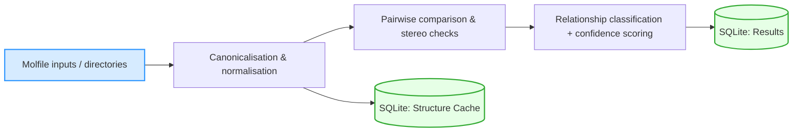

# StereoMapper: Clarifying Metabolite Identity Through Stereochemically Aware Relationship Assignment

[]()
[]()

## Overview

StereoMapper is a stereochemistry-aware metabolite mapping pipeline that classifies molecular relationships (e.g., enantiomers, diastereomers, protomers) across biochemical databases. It provides high-resolution identity mapping to support genome-scale metabolic model curation.

---
## Key features
- Stereochemistry-aware relationship assignment (identical, enantiomer, diastereomer, etc.)
- Cache-accelerated re-runs for large corpora 
- SQLite output for easy downstream analysis
- Simple CLI commands
 
--- 



## Repository Structure

```bash 
├── src/ # Core source code 
│ ├── classification # modules for classifying relationships
│ ├── comparison # modules which run comparison functionality
│ ├── config # configuration modules
│ ├── data # scripts for setting up databases
│ ├── domain # main chemistry functionality of pipeline
│ ├── models # data models for structuring output classifications
│ ├── processing # host of processing modules
│ ├── results # helper modules for constructing outputs
│ ├── runners # orchestrating module for running pipeline
│ ├── scoring # module for generating confidence scores
│ ├── utils/ # Helper modules for setting up CLI etc.
│ └── tests/ # Unit and integration tests 
├── pyproject.toml # Python dependencies 
├── LICENSE 
└── README.md 
```

--- 

## Installation 

First clone the repo and navigate into the directory.

### Option A: Clone with HTTPS
```bash
git clone https://github.com/Digital-Metabolic-Twin-Centre/stereomapper.git
cd stereomapper
```

### Option B: Clone with SSH
```bash
git clone git@github.com:Digital-Metabolic-Twin-Centre/stereomapper.git
cd stereomapper
```

Now ensure you create a virtual environment to install the stereomapper package.

### Option A: Conda
```bash
# create env 
conda env create -n stereomapper python=3.11 #recommended
conda activate stereomapper

# install from source
pip install .
```

### Option B: uv

For this option, ensure you have `uv` installed on your machine. If not download and install from the following: [uv](https://docs.astral.sh/uv/getting-started/installation/).

```bash
uv venv stereomapper
# activate the environment
source stereomapper/bin/activate

# now install from source
uv pip install .
```

## Development install (editable)
```bash
# pip
pip install -e .

# uv
uv pip install -e .
```

## Quickstart
```bash 

# ensure you have activated your enviornment where you installed stereomapper
conda activate stereomapper # or source stereomapper/bin/activate

# try running against the example data from the repo
stereomapper run \
    --input-dir data/example_molfiles_dir \ 
    --sqlite-output results/example.sqlite

# take a peek at the results (table names are documented below)
sqlite3 results/example.sqlite '.tables'
sqlite3 results/example.sqlite 'SELECT * FROM relationships LIMIT 10;'
```

## Usage 
```bash
stereomapper run  --input data/example_molfiles_dir --sqlite-output run1.sqlite
``` 

### Common patterns
```bash
# specify directory + recursion 
stereomapper run --input-dir data/molfiles_dir_recursive --recursive --sqlite-output run2.sqlite

# specify a location to store the structure cache instead of the default location
stereomapper run --input-dir data/molfiles --cache-path results/cache/structure_cache1.sqlite --sqlite-output run3.sqlite

# specify to create a fresh cache at the specified path (can also create fresh cache at default by omitting the path argument)
stereomapper run --input_dir data/molfiles --cache-path results/cache/structure_cache1.sqlite --sqlite-output run4.sqlite --fresh-cache
```

### Configuration Options
| Parameter | Description | Default |
|:----------:|:-----------:|:---------:|
| `--input` | Python list of input files |  |
| `--input-dir` | Path to directory containing molfiles |  |
| `--sqlite-output` | Path to the final output database containing results | Created if missing |
| `--recursive` | Used with `--input-dir`, searches directories recursively | False |
| `--cache-path` | Path to the structure cache database | Default location (.cache) |
| `--fresh-cache` | Create a fresh cache database at the specified path | False |
| `--relate-with-cache` | Relate new structures with those already in the cache | False |
| `--namespace` | Tag structures with a specific tag for traceability in runs | "default" |

Other options specific to performance and debugging can be found using the following command:

```bash
stereomapper run --help
```

## Outputs

StereoMapper writees two SQLite databases:
- **(1) Structure cache** (e.g., `.cache/structures.sqlite)  
Caches canonicalised, normalised structures for reuse.

- **(2) Output database** (e.g., results/run1.sqlite) 
Contains final identity mappings and relationship assignments.

### Example queries
```sql 
-- Top relationship counts
SELECT classification, COUNT(*)
FROM relationships
GROUP BY classification
ORDER BY COUNT(*) DESC;

-- Enantiomer pairs with high confidence 
SELECT *
FROM relationships
WHERE classification = 'Enantiomers' and confidence >= 90
LIMIT 50;
```

## Citation 
If you use StereoMapper in your work, please cite the following:

```
McGoldrick J. et al. StereoMapper: A stereochemistry-aware metabolite mapping framework for biochemical databases. 2025.
[DOI or preprint link here]
```

## Contact

For questions:

**Jack McGoldrick**
j.mcgoldrick9@universityofgalway.ie
