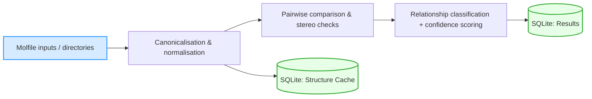

# StereoMapper: Clarifying Metabolite Identity Through Stereochemically Aware Relationship Assignment

[]()
[]()

## Overview

StereoMapper is a stereochemistry-aware metabolite mapping pipeline that classifies molecular relationships (e.g., enantiomers, diastereomers, protomers) across biochemical databases. It provides high-resolution identity mapping to support genome-scale metabolic model curation.

---
## Key features
- Stereochemistry-aware relationship assignment (identical, enantiomer, diastereomer, etc.)
- Cache-accelerated re-runs for large corpora
- SQLite output for easy downstream analysis
- Simple CLI commands

---


```mermaid
flowchart LR
    A[Molfile inputs / directories] --> B[Canonicalisation & normalisation]
    B --> C[Pairwise comparison & stereo checks]
    C --> D[Relationship classification + confidence scoring]
    D --> E[(SQLite: Results)]
    B --> F[(SQLite: Structure Cache)]

    style A fill:#d6ebff,stroke:#3399FF,stroke-width:2px
    style E fill:#e6ffe6,stroke:#3a3,stroke-width:2px
    style F fill:#e6ffe6,stroke:#3a3,stroke-width:2px
```

## Repository Structure

```bash
├── src/ # Core source code
│ ├── classification # modules for classifying relationships
│ ├── comparison # modules which run comparison functionality
│ ├── config # configuration modules
│ ├── data # scripts for setting up databases
│ ├── domain # main chemistry functionality of pipeline
│ ├── models # data models for structuring output classifications
│ ├── processing # host of processing modules
│ ├── results # helper modules for constructing outputs
│ ├── runners # orchestrating module for running pipeline
│ ├── scoring # module for generating confidence scores
│ ├── utils/ # Helper modules for setting up CLI etc.
│ └── tests/ # Unit and integration tests
├── pyproject.toml # Python dependencies
├── LICENSE
└── README.md
```

---

## Installation

First clone the repo and navigate into the directory.

### Option A: Clone with HTTPS
```bash
git clone https://github.com/Digital-Metabolic-Twin-Centre/stereomapper.git
cd stereomapper
```

### Option B: Clone with SSH
```bash
git clone git@github.com:Digital-Metabolic-Twin-Centre/stereomapper.git
cd stereomapper
```

Now ensure you create a virtual environment to install the stereomapper package.

### Option A: Conda
```bash
# create env
conda env create -n stereomapper python=3.11 #recommended
conda activate stereomapper

# install from source
pip install .
```

### Option B: Python
```bash
# create env
python -m venv .stereomapper
source .stereomapper/bin/activate

# now install from source
pip install .
```

### Option C: uv

For this option, ensure you have `uv` installed on your machine. If not download and install from the following: [uv](https://docs.astral.sh/uv/getting-started/installation/).

```bash
uv venv stereomapper
# activate the environment
source stereomapper/bin/activate

# now install from source
uv pip install .
```

## Development install (editable)
```bash
# pip
pip install -e .

# uv
uv pip install -e .
```

### Reproducible environment
If you prefer a fully pinned toolchain (especially for RDKit/OpenBabel builds), create the project’s curated Conda environment:

```bash
mamba env create -f environment.yml
conda activate stereomapper
# install package entrypoint referencing already-installed deps
pip install -e . --no-deps
```

The `environment.yml` file mirrors the constraints in `pyproject.toml` and adds the extra toolchain packages needed on Linux/macOS.

## Quickstart
```bash

# ensure you have activated your environment where you installed stereomapper
conda activate stereomapper # or source stereomapper/bin/activate

# try running against an example from the repo, lets try enantiomer examples
stereomapper run \
    --input-dir examples/enantiomer_files \
    --sqlite-output results/enantiomer_results.sqlite # ensure output dir exists

```

If you prefer a pinned copy of the example inputs and the matching SQLite output, download the archived package from Zenodo (DOI: [10.5281/zenodo.19251670](https://doi.org/10.5281/zenodo.19251670)) and extract it into the repository root before running the commands above.

To take a look at the outputs we can query directly via the terminal, or we can use an application like dbeaver or SQLite in VSCode.

```bash
# for terminal access, in ubuntu
sudo apt install sqlite3
```

or if using mac

```bash
brew install sqlite3
```

Then run the following commands to analyse the outputs

```bash
sqlite3 results/enantiomer_results.sqlite '.tables'
sqlite3 results/enantiomer_results.sqlite 'SELECT * FROM relationships;'
```

## Usage - run on all example molfiles recursively
```bash
stereomapper run --input-dir examples --sqlite-output results/all_results.sqlite -R

# query clusters (equivalence)
sqlite3 results/all_results.sqlite 'SELECT * FROM clusters;'
# query all relationships
sqlite3 results/all_results.sqlite 'SELECT * FROM relationships;'
```

### Common patterns
```bash
# specify directory + recursion
stereomapper run --input-dir examples/ --recursive --sqlite-output all_results2.sqlite

# specify a location to store the structure cache instead of the default location
stereomapper run --input-dir examples/diastereomer_files --cache-path results/cache/diastereomer_cache.sqlite --sqlite-output diastereomer_results.sqlite

# specify to create a fresh cache at the specified path (can also create fresh cache at default by omitting the path argument)
stereomapper run --input_dir examples/protomer_files --cache-path results/cache/prtomer_cache.sqlite --sqlite-output protomer_results.sqlite --fresh-cache
```

### Configuration Options
| Parameter | Description | Default |
|:----------:|:-----------:|:---------:|
| `--input` | Python list of input files |  |
| `--input-dir` | Path to directory containing molfiles |  |
| `--sqlite-output` | Path to the final output database containing results | Created if missing |
| `--recursive` | Used with `--input-dir`, searches directories recursively | False |
| `--cache-path` | Path to the structure cache database | Default location (.cache) |
| `--fresh-cache` | Create a fresh cache database at the specified path | False |
| `--relate-with-cache` | Relate new structures with those already in the cache | False |
| `--namespace` | Tag structures with a specific tag for traceability in runs | "default" |

Other options specific to performance and debugging can be found using the following command:

```bash
stereomapper run --help
```

## Outputs

StereoMapper writees two SQLite databases:
- **(1) Structure cache** (e.g., `.cache/structures.sqlite)
Caches canonicalised, normalised structures for reuse.

- **(2) Output database** (e.g., results/run1.sqlite)
Contains final identity mappings and relationship assignments.

See `docs/sqlite_schema.sql` (machine-readable DDL) and `docs/sqlite_schema.md` (column descriptions) for the exact schema shared by all StereoMapper runs. Bundle these files whenever you redistribute `.sqlite` outputs.

Each row in `relationships` now provides both the human-readable `classification` and a machine-actionable `classification_term_id` drawn from the StereoMapper Relationship Ontology (SMRO). The controlled vocabulary is published in `docs/ontology/relationship_terms.csv`.

Example molfiles are indexed in `examples/manifest.csv`, which records the provenance, checksum, and relationship class (plus SMRO identifier) for every file in the `examples/` tree. Include this manifest—and the Zenodo archive mentioned below—when sharing derived datasets so downstream users can audit provenance.

### Example queries
```sql
-- Top relationship counts
SELECT classification, COUNT(*)
FROM relationships
GROUP BY classification
ORDER BY COUNT(*) DESC;

-- Enantiomer pairs with high confidence
SELECT *
FROM relationships
WHERE classification = 'Enantiomers' and confidence >= 90
LIMIT 50;

-- Check which clusters contain more than one member (considered duplicates if testing on single database)
SELECT *
FROM clusters
WHERE member_count > 1
ORDER BY COUNT(*) DESC;
```

## Paper
The pre-print of the paper can be found in bioRxiv at the following DOI:

[McGoldrick J. et al. StereoMapper: Clarifying Metabolite Identity Through Stereochemically Aware Relationship Assignment. 2025.](https://doi.org/10.64898/2025.12.09.693222)

## Community
- See [`CONTRIBUTING.md`](CONTRIBUTING.md) for development workflow, testing, and data-submission guidelines.
- All participants are expected to follow the [`CODE_OF_CONDUCT.md`](CODE_OF_CONDUCT.md) when engaging in issues, discussions, or pull requests.

## Contact

For questions:

**Jack McGoldrick**
j.mcgoldrick9@universityofgalway.ie
