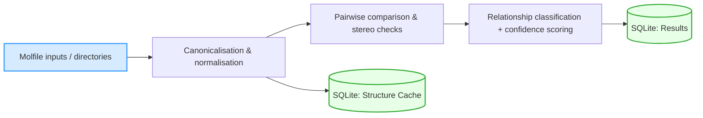

# StereoMapper: Clarifying Metabolite Identity Through Stereochemically Aware Relationship Assignment

[](#requirements)
[](#requirements)
[](https://github.com/Digital-Metabolic-Twin-Centre/stereomapper/actions/workflows/ci.yml)
[](LICENSE)
[](https://doi.org/10.5281/zenodo.19251670)

## Overview

StereoMapper is a stereochemistry-aware metabolite mapping pipeline that classifies molecular relationships (e.g., enantiomers, diastereomers, protomers) across biochemical databases. It provides high-resolution identity mapping to support genome-scale metabolic model curation. It has been benchmarked on curated control datasets and applied at scale to 1.3M+ molecular structures from major metabolic databases — see [Citation](#citation) for the full evaluation.

If StereoMapper is useful in your work, please [cite it](#citation).

---

## Table of contents

- [Key features](#key-features)
- [Repository structure](#repository-structure)
- [Requirements](#requirements)
- [Installation](#installation)
- [Quickstart](#quickstart)
- [Configuration options](#configuration-options)
- [Usage](#usage)
- [Outputs](#outputs)
- [Citation](#citation)
- [Community](#community)
- [Contact](#contact)

---
## Key features
- Stereochemistry-aware relationship assignment (identical, enantiomer, diastereomer, etc.)
- Cache-accelerated re-runs for large corpora
- SQLite output for easy downstream analysis
- Simple CLI commands

---


```mermaid
flowchart LR
    A[Molfile inputs / directories] --> B[Canonicalisation & normalisation]
    B --> C[Pairwise comparison & stereo checks]
    C --> D[Relationship classification + confidence scoring]
    D --> E[(SQLite: Results)]
    B --> F[(SQLite: Structure Cache)]

    style A fill:#d6ebff,stroke:#3399FF,stroke-width:2px
    style E fill:#e6ffe6,stroke:#3a3,stroke-width:2px
    style F fill:#e6ffe6,stroke:#3a3,stroke-width:2px
```

## Repository Structure

```bash
├── docs/ # Schema + ontology docs
│ ├── ontology/ # Controlled vocabulary (SMRO)
│ ├── sqlite_schema.md # Human-readable schema
│ └── sqlite_schema.sql # Canonical schema definition
├── examples/ # Example molfiles and manifest
│ └── manifest.csv # Sample metadata + checksums
├── experiments/ # Exploratory runs and notebooks
├── logs/ # Runtime logs (optional)
├── results/ # Generated SQLite outputs (optional)
├── src/ # Core source code
│ ├── classification # Relationship classification modules
│ ├── comparison # Pairwise comparison logic
│ ├── config # Configuration modules
│ ├── data # Database setup helpers
│ ├── domain # Chemistry domain logic
│ ├── models # Output data models
│ ├── processing # Processing pipeline stages
│ ├── results # Output construction helpers
│ ├── runners # Pipeline orchestration
│ ├── scoring # Confidence scoring
│ ├── utils/ # CLI + general utilities
│ └── tests/ # Unit and integration tests
├── CITATIONS.cff # Citation metadata
├── CODE_OF_CONDUCT.md
├── CONTRIBUTING.md
├── LICENSE
├── README.md
├── codemeta.json # Machine-readable metadata
├── environment.yml # Conda environment (pinned)
├── pyproject.toml # Python package metadata/deps
└── uv.lock # uv lockfile
```

---

## Requirements

- **OS:** Linux or macOS (not currently tested on Windows).
- **Python:** ≥ 3.9 (CI runs against 3.10, 3.11, and 3.12).
- **Cheminformatics toolkits:** [RDKit](https://www.rdkit.org/) and [Open Babel](https://openbabel.org/) are pulled in automatically as pinned wheels (`rdkit==2025.3.3`, `openbabel-wheel==3.1.1.22`) when you `pip`/`uv` install the package — no separate system install is needed. If you hit build errors on an unusual platform, use the pinned [Conda environment](#reproducible-environment) instead.
- **Scale:** designed for large corpora — the accompanying [paper](#citation) applied StereoMapper to 1.3M+ structures, using the structure cache to accelerate re-runs.

---

## Installation

First clone the repo and navigate into the directory.

### Option A: Clone with HTTPS
```bash
git clone https://github.com/Digital-Metabolic-Twin-Centre/stereomapper.git
cd stereomapper
```

### Option B: Clone with SSH
```bash
git clone git@github.com:Digital-Metabolic-Twin-Centre/stereomapper.git
cd stereomapper
```

Now ensure you create a virtual environment to install the stereomapper package.

### Option A: Conda
```bash
# create env
conda env create -n stereomapper python=3.11 #recommended
conda activate stereomapper

# install from source
pip install .
```

### Option B: Python
```bash
# create env
python -m venv .stereomapper
source .stereomapper/bin/activate

# now install from source
pip install .
```

### Option C: uv

For this option, ensure you have `uv` installed on your machine. If not download and install from the following: [uv](https://docs.astral.sh/uv/getting-started/installation/).

```bash
uv venv stereomapper
# activate the environment
source stereomapper/bin/activate

# now install from source
uv pip install .
```

## Development install (editable)
```bash
# pip
pip install -e .

# uv
uv pip install -e .
```

### Reproducible environment
If you prefer a fully pinned toolchain (especially for RDKit/OpenBabel builds), create the project’s curated Conda environment:

```bash
mamba env create -f environment.yml
conda activate stereomapper
# install package entrypoint referencing already-installed deps
pip install -e . --no-deps
```

The `environment.yml` file mirrors the constraints in `pyproject.toml` and adds the extra toolchain packages needed on Linux/macOS.

## Quickstart
```bash

# ensure you have activated your environment where you installed stereomapper
conda activate stereomapper # or source stereomapper/bin/activate

# try running against an example from the repo, lets try enantiomer examples
stereomapper run \
    --input-dir examples/enantiomer_files \
    --sqlite-output results/enantiomer_results.sqlite # ensure output dir exists

```

If you prefer a pinned copy of the example inputs and the matching SQLite output, download the archived package from Zenodo (DOI: [10.5281/zenodo.19251670](https://doi.org/10.5281/zenodo.19251670)) and extract it into the repository root before running the commands above.

To take a look at the outputs we can query directly via the terminal, or we can use an application like dbeaver or SQLite in VSCode.

```bash
# for terminal access, in ubuntu
sudo apt install sqlite3
```

or if using mac

```bash
brew install sqlite3
```

Then run the following commands to analyse the outputs

```bash
sqlite3 results/enantiomer_results.sqlite '.tables'
sqlite3 results/enantiomer_results.sqlite 'SELECT * FROM relationships;'
```

## Configuration options

| Parameter | Description | Default |
|:----------:|:-----------:|:---------:|
| `--input` | Python list of input files |  |
| `--input-dir` | Path to directory containing molfiles |  |
| `--sqlite-output` | Path to the final output database containing results | Created if missing |
| `--output-format` | Output format: `sqlite` (default) or `csv` (exports single `.xlsx` workbook with 4 sheets) | sqlite |
| `--recursive` | Used with `--input-dir`, searches directories recursively | False |
| `--cache-path` | Path to the structure cache database | Default location (.cache) |
| `--fresh-cache` | Create a fresh cache database at the specified path | False |
| `--relate-with-cache` | Relate new structures with those already in the cache | False |
| `--namespace` | Tag structures with a specific tag for traceability in runs | "default" |

Other options specific to performance and debugging can be found using the following command:

```bash
stereomapper run --help
```

## Usage

Run recursively over all example molfiles:
```bash
stereomapper run --input-dir examples --sqlite-output results/all_results.sqlite -R

# query clusters (equivalence)
sqlite3 results/all_results.sqlite 'SELECT * FROM clusters;'
# query all relationships
sqlite3 results/all_results.sqlite 'SELECT * FROM relationships;'
```

### Common patterns
```bash
# specify directory + recursion
stereomapper run --input-dir examples/ --recursive --sqlite-output all_results2.sqlite

# specify a location to store the structure cache instead of the default location
stereomapper run --input-dir examples/diastereomer_files --cache-path results/cache/diastereomer_cache.sqlite --sqlite-output diastereomer_results.sqlite

# specify to create a fresh cache at the specified path (can also create fresh cache at default by omitting the path argument)
stereomapper run --input-dir examples/protomer_files --cache-path results/cache/protomer_cache.sqlite --sqlite-output protomer_results.sqlite --fresh-cache

# export results as a single spreadsheet workbook with 4 sheets
stereomapper run --input-dir examples/enantiomer_files --sqlite-output results/enantiomer_results.xlsx --output-format csv
```

## Outputs

StereoMapper writes two SQLite databases:

- **(1) Structure cache** (e.g., `.cache/structures.sqlite`) — caches canonicalised, normalised structures for reuse.
- **(2) Output database** (e.g., `results/run1.sqlite`) — contains final identity mappings and relationship assignments.

See `docs/sqlite_schema.sql` (machine-readable DDL) and `docs/sqlite_schema.md` (column descriptions) for the exact schema shared by all StereoMapper runs. Bundle these files whenever you redistribute `.sqlite` outputs.

### Classification & ontology

Each row in `relationships` provides both the human-readable `classification` and a machine-actionable `classification_term_id` drawn from the StereoMapper Relationship Ontology (SMRO). The controlled vocabulary is published in `docs/ontology/relationship_terms.csv`. For `Stereo-resolution pairs`, `relationships.direction` indicates the more-resolved structure (`A_to_B` means `cluster_a` is more stereochemically resolved than `cluster_b`; `B_to_A` means the opposite). The field is NULL for symmetric relationships.

**Example `relationships` rows:**

| cluster_a | cluster_b | classification | classification_term_id | direction | score |
| :---: | :---: | :---: | :---: | :---: | :---: |
| 12 | 47 | Enantiomers | SMRO:0000012 | NULL | 96 |
| 12 | 88 | Diastereomers | SMRO:0000015 | NULL | 91 |
| 47 | 103 | Stereo-resolution pairs | SMRO:0000021 | A_to_B | 84 |

### Provenance

Example molfiles are indexed in `examples/manifest.csv`, which records the provenance, checksum, and relationship class (plus SMRO identifier) for every file in the `examples/` tree. Include this manifest—and the Zenodo archive mentioned below—when sharing derived datasets so downstream users can audit provenance.

### Example queries
```sql
-- Top relationship counts
SELECT classification, COUNT(*)
FROM relationships
GROUP BY classification
ORDER BY COUNT(*) DESC;

-- Enantiomer pairs with high confidence
SELECT *
FROM relationships
WHERE classification = 'Enantiomers' and score >= 90
LIMIT 50;

-- Check which clusters contain more than one member (considered duplicates if testing on single database)
SELECT *
FROM clusters
WHERE member_count > 1
ORDER BY COUNT(*) DESC;
```

## Citation

The pre-print of the paper can be found in bioRxiv at the following DOI:

[McGoldrick J. et al. StereoMapper: Clarifying Metabolite Identity Through Stereochemically Aware Relationship Assignment. 2025.](https://doi.org/10.64898/2025.12.09.693222)

If you use StereoMapper in your work, please cite it:

```bibtex
@article{mcgoldrick2025stereomapper,
  title   = {StereoMapper: Clarifying Metabolite Identity Through Stereochemically Aware Relationship Assignment},
  author  = {McGoldrick, Jack and Pagni, Marco and Alwer, Saleh and Cooney, Joanne and Makosa, Natalia
             and Niknejad, Anne and Moretti, S{\'e}bastien and Murphy, Jadzia and Martinelli, Filippo
             and Bridge, Alan and Thiele, Ines and Fleming, Ronan M. T.},
  year    = {2025},
  journal = {bioRxiv},
  doi     = {10.64898/2025.12.09.693222},
  url     = {https://doi.org/10.64898/2025.12.09.693222}
}
```

Full structured metadata (including all author ORCIDs) is available in [`CITATIONS.cff`](CITATIONS.cff).

## Community
- See [`CONTRIBUTING.md`](CONTRIBUTING.md) for development workflow, testing, and data-submission guidelines.
- All participants are expected to follow the [`CODE_OF_CONDUCT.md`](CODE_OF_CONDUCT.md) when engaging in issues, discussions, or pull requests.

## Contact

For bug reports and feature requests, please use [GitHub Issues](https://github.com/Digital-Metabolic-Twin-Centre/stereomapper/issues) so the discussion is visible to other users.

For other questions, contact:

**Jack McGoldrick**
j.mcgoldrick9@universityofgalway.ie
